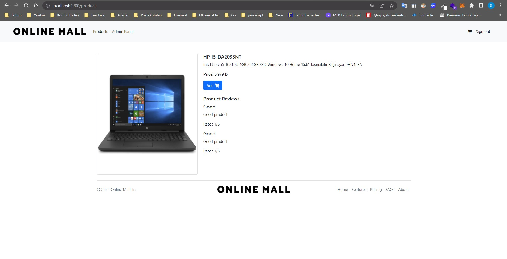

# e-commerseApp

#### Languages and Tools:

> Angular, javascript, typscript, nodejs, html5, css, bootstrap v5

#### About:

> e-commerceApp is  Patika-Orion Innovation Turkey Angular Bootcamp last project. I try to make an online shopping app. There are two different user profile as admin and user. Admins can change, del, edit product and add new products. Users can see and buy products.

#### Pictures

1. Register

2. User login

3. Admin Login

4. Admin Panel

5. New Product

6. Edit Product

7. Main Page

8. Product

9. Cart

10. Buy

#### Packages And Modules

> ModelModule, RouterModule, HttpClientModule, FormsModule, ReactiveFormsModule, BrowserModule, AuthGuard, Font Awesome, Bootstrap 5, json-server

#### Requirements

> Codding Editor, Angular Framwork (v13), Bootstrap (v5), npm, yarn, json-server username:admin password:1234

#### Contact

> severinseverinov@hotmail.com

